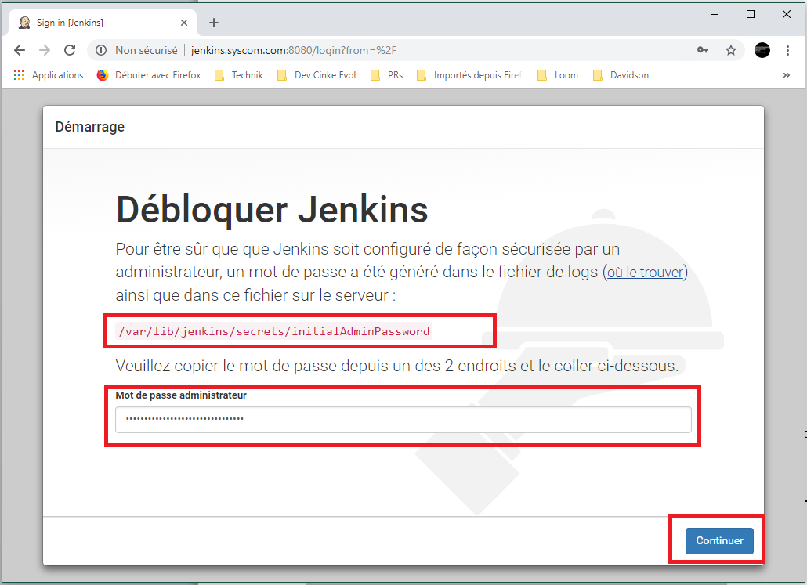
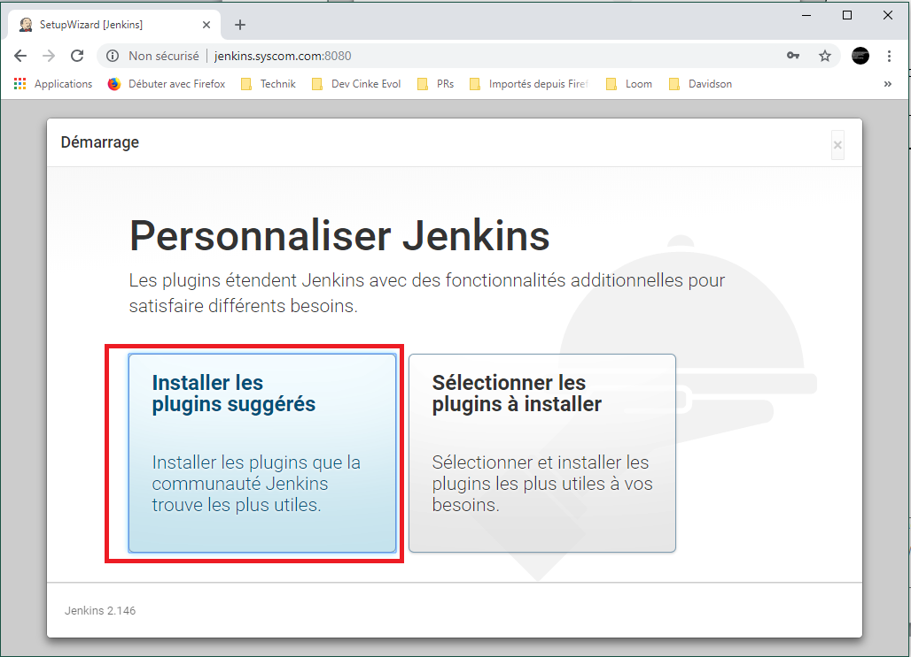
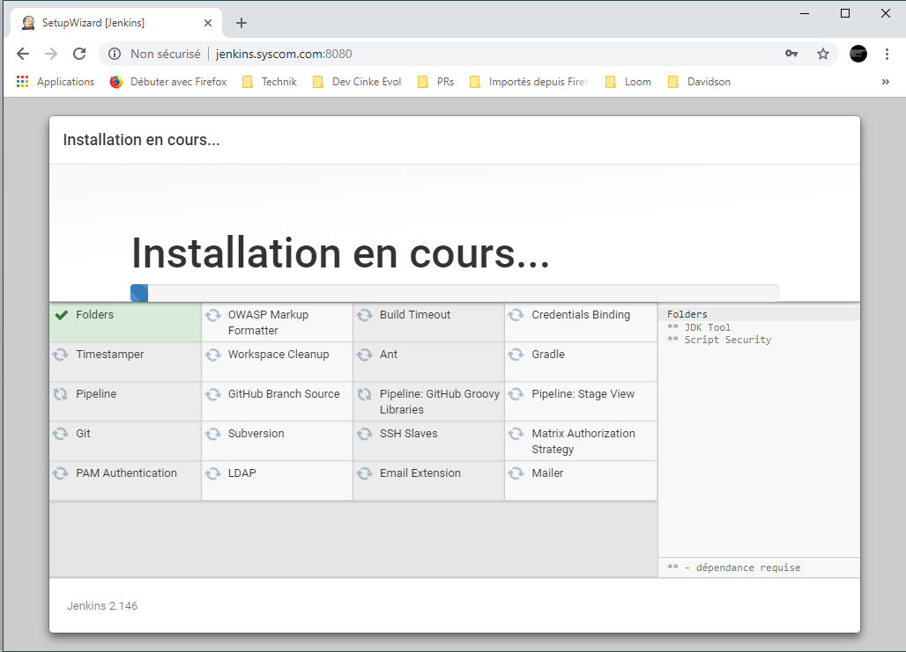
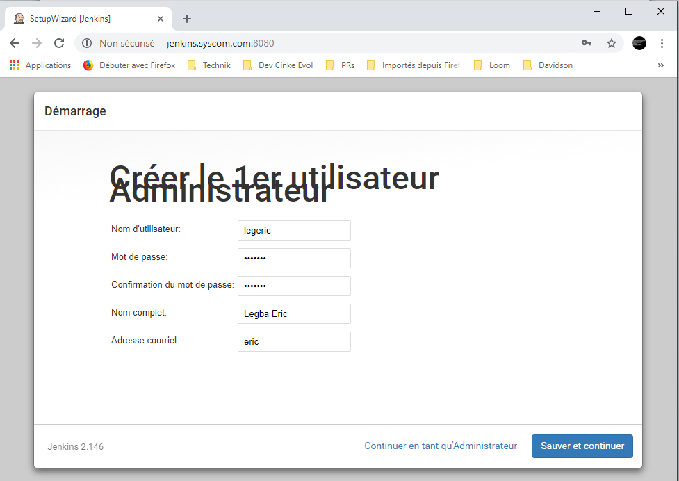
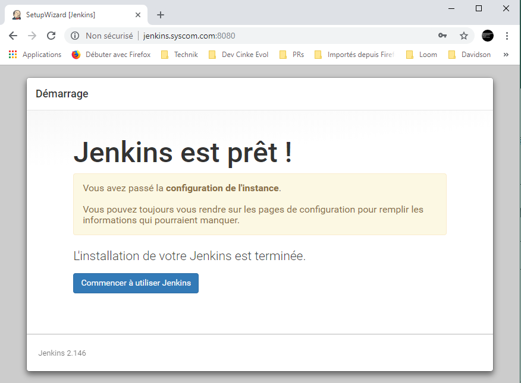

## 1er Pas sur Jenkins

### Saisie du mot de passe de sécurité de Jenkins

  Rendez-vous sur la page d'accueil de Jenkins à l'adresse http://address-ip:8080/.

 

  Il faut lire le fichier `/var/lib/jenkins/secrets/initialAdminPassword` pour connaître le mot de passe.

  ```
  root@vm-debian-1:~# more /var/lib/jenkins/secrets/initialAdminPassword
  e71bb52257ed46e898fe1e7ab7470456
  ```

### Installation des plugins Jenkins suggérés

  Il est conseillé d’installer les plugins suggérés. Plus tard, nous installerons des plugins supplémentaires au fur et à mesure que les besoins se feront ressentir.

  

  

### Création d'un compte Administrateur Jenkins

  Il s'agit de créer un compte d'administrateur pour Jenkins.

  
  

  La 1ère configuration de Jenkins est terminée.
