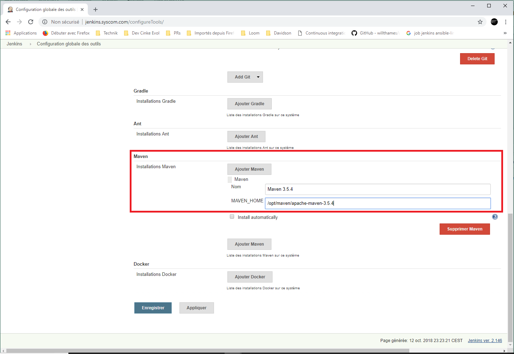

## Configuration

### Administration de Jenkins

  Une fois connecté à la page d'accueil, nous irons sur la page d'administration de Jenkins. Elle est la page la plus importante de Jenkins. Elle nous permettra de configurer la quasi-totalité des paramètres du serveur Jenkins. Pour s'y rendre, cliquer sur le lien `Administrer Jenkins`. Pour y aller plus simplement, taper le mot-clé `manage` dans la boîte de recherche.

  

  1. Configuration globale des outils

  Il s'agit de configurer les outils tels que le JDK, Git, Maven.

  Pour cela, depuis la page d'administration principale, cliquer sur le lien `Configuration globale des outils` et s’inspirer des captures d’écran ci-dessous.

  

  

  2. Configuration du serveur de messagerie électronique

  Le serveur de messagerie sera utilisé par Jenkins pour envoyer des mails de notification à la fin de l’exécution des jobs. Ici, nous utiliserons le serveur SMTP de Gmail comme serveur de push de mails. Dans un contexte professionnel, nous vous laissons le soin de renseigner les paramètres de votre serveur SMTP (Postfix, Sendmail, etc…). Rendez-vous dans `Administrer Jenkins - Configurer le système - Notification par Email`.
  Saisir l’adresse du serveur SMTP et cliquer sur le bouton `Avancé`.

  

  *   Serveur SMTP : smtp.gmail.com
  *   Utiliser l’authentification par SMTP : Oui
  *   Nom d’utilisateur : adresse_mail@gmail.com
  *   Mot de passe : mot_de_passe
  *   Utiliser SSL : Oui
  *   Port SMTP : Indiquer le port SSL/SMTP
  *   Tester la configuration en envoyant un mail de test : Oui
  *   Destinataire du courriel de test : indiquer l’adresse mail destinataire du mail de test.

  3. Installation de plugins

  Pour installer des plugins supplémentaires à Jenkins, rendez-vous sur la page d'administration principale `Administrer Jenkins`. Ensuite, cliquer sur `Gestion des plugins`.
  Dans l'onglet `Disponible`, saisir dans le filtre le nom du plugin  à installer.
  Si le plugin est disponible, il faut le sélectionner en cochant la case correspondante.
  Vous pouvez rajouter autant de plugins que vous désirez. À la fin, cliquer sur le bouton `Installer sans redémarrer`.

  

  Voici une liste de plugins pertinents :

  *   `Rebuild` : Il permet de disposer du bouton `Rebuild last` qui lance la dernière instance d'un job sans ressaisir les paramètres.
  *   `Global Variable String Parameter` : il permet de définir des variables globales à l’environnement. Ces variables seront accessibles à tous les jobs. Son utilité est de définir par exemple l’adresse du repository Nexus, des credentials d’accès au repo Nexus, etc.
  *   `EnvInject Plugin` : plugin pour prendre en charge les variables d’environnement injectées dans les jobs Jenkins.
  *   `mask-passwords` : plugin pour gérer les saisies de mot de passe.
  *   `Job DSL` : plugin pour générer des Jobs DSLs.
  *   `ansicolor`: affichage en couleur des logs console des jobs.
