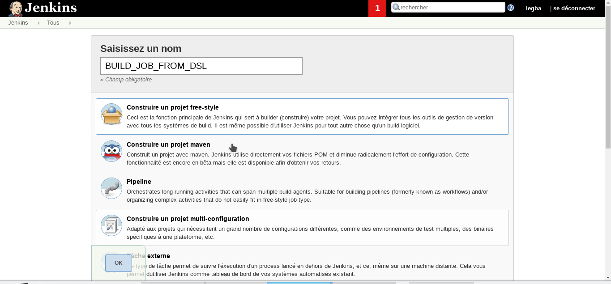
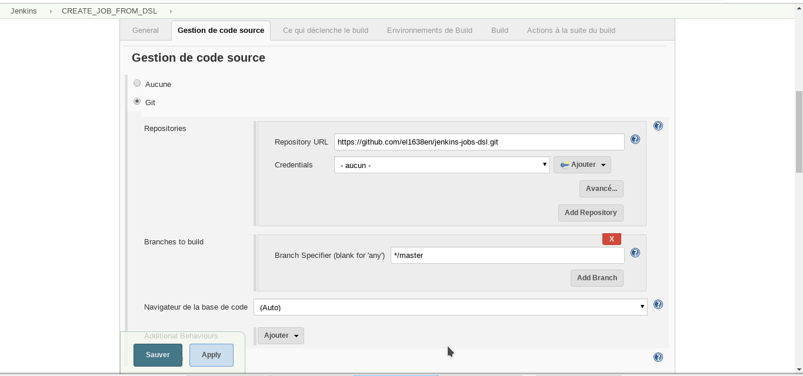
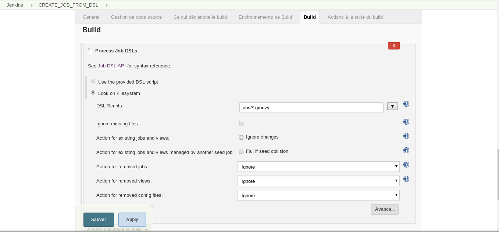
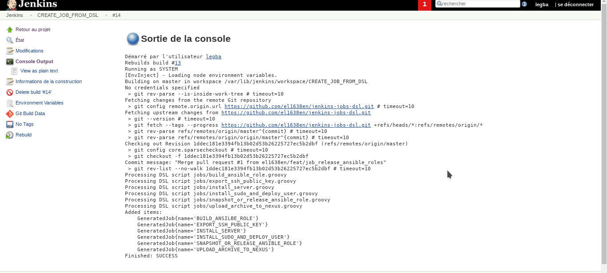

## Jenkins Job DSL

Jenkins Jobs DSL désigne 2 technologies que sont :
 - DSL qui permet de décrire des Jobs sous forme de code. Il s'appuie sur le langage Groovy
 - le plugins Jenkins qui permet de générer un job Jenkins à partir du code Groovy.
Grâce au Jenkins Jobs DSL, les jobs sont écrits en code Groovy et versionnés sur un repository Git.
Ensuite, le plugin DSL de Jenkins convertit les codes en Jobs utilisables.

  1. Installer le plugin `JOb DSL`

    Rendez-vous sur la page d'administration principale `Administrer Jenkins`.
    Ensuite, cliquer sur `Gestion des plugins`.
    Installer le plugin `Job DSL`.

  2. Désactiver la sécurité sur les `JOb DSL`

    Par défaut, Jenkins est configuré pour activer la sécurité sur les scripts des Jobs DSL.
    Il faut désactiver cette sécurité pour générer des jobs DSL.
    Rendez-vous sur la page d'accueil de Jenkins et cliquer sur «Administrer Jenkins ⇒ Configurer la sécurité globale».
    Désactiver «Enable script security for Job DSL scripts».

  3. Super-job de génération de Job DSL

    Nous allons écrire un job qui :
    - va récupérer les jobs DSL sur un repository Github
    - utiliser le plugin `Job DSL` pour convertir chaque job DSL en job réel utilisable.

    Pour créer ce super-job, procéder comme suit :

    - «Nouveau item ⇒ Construire un job free-style»

    

    - Indiquer le repository Github où sont stockés les Jobs

    

    - Indiquer le répertoire où sont stockés les Jobs
    Dans notre cas, les jobs DSL sont dans le répertoire «jobs» (indiquer donc l'expression régulière `jobs/*.groovy`)

    

  4. Lancer le job et constater la création des jobs Jenkins

  
