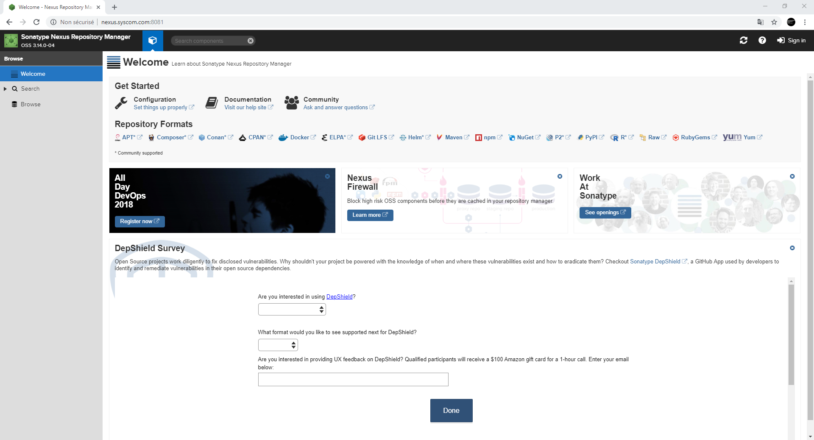

## Installation

  1. Création d’un nouvel utilisateur

    Créer un nouvel utilisateur `nexus` dont le mot de passe est `nexus`.

    ```
    root@vm-debian-1:~# adduser nexus
    ```

  2. Télécharger l’archive de Nexus

      1. Télécharger et dézipper le fichier archive de Nexus. Le répertoire d’installation de Nexus sera `/opt/nexus`

      ```nexus/
      root@vm-debian-1:~# cd /tmp
      root@vm-debian-1:/tmp# wget https://download.sonatype.com/nexus/3/latest-unix.tar.gz
      root@vm-debian-1:/tmp# tar -zxvf latest-unix.tar.gz
      root@vm-debian-1:/tmp# mv nexus-3.14.0-04 /opt/nexus
      root@vm-debian-1:/tmp# mv sonatype-work /opt/sonatype-work
      ```

      2. Attribuer les droits sur les répertoires.

      ```
      root@vm-debian-1:~# chown -R nexus:nexus /opt/nexus
      root@vm-debian-1:~# chown -R nexus:nexus /opt/sonatype-work
      ```

  3. Configuration du service de Nexus

    Pour démarrer Nexus au lancement de la machine, il faut configurer un service Nexus avec SystemD. Pour cela

      1. créer le fichier `/lib/systemd/system/nexus.service`

      ```
      root@vm-debian-1:~# touch /lib/systemd/system/nexus.service
      ```

      2. y copier le contenu ci-dessous `vim /lib/systemd/system/nexus.service`

      ```
      [Unit]
      Description=Nexus service
      After=network.target

      [Service]
      Type=forking
      ExecStart=/opt/nexus/bin/nexus start
      ExecStop=/opt/nexus/bin/nexus stop
      User=nexus
      Restart=on-abort

      [Install]
      WantedBy=multi-user.target
      ```

    3. activer le nouveau service

      ```
      root@vm-debian-1:~# systemctl enable nexus.service
      ```

  4. Autres configurations

    1. Configuration du port et de l'adresse IP de Nexus

        Le fichier de configuration de Nexus est `/opt/nexus/etc/nexus.properties`.

        - Port Nexus : par défaut, Nexus est accessible sur le port 8081. On peut modifier ce port par défaut.
          Pour cela, remplacer `application-port=8081` par `application-port=port_choisi`, `port_choisi` représentant le port de votre choix (port 8080 par exemple).

        - Adresse IP : Pour modifier l'adresse IP de  Nexus, il faut modifier la ligne `application-host=0.0.0.0` par `application-host=adresse_ip`, `adresse_ip` représentant l'adresse IP de votre choix.

    2. Ouverture de port iptables

        Si un par-feu `iptables` est actif sur la machine, il faut ouvrir le port  d’écoute du serveur Nexus.

        ```
        root@vm-debian-1:~# iptables -A INPUT -p tcp -m tcp --dport 8081 -m comment --comment "Nexus Trafic" -j ACCEPT
        ```

  5. Démarrer Nexus

    Pour démarrer Nexus, exécuter la commande :

    ```
    root@vm-debian-1:~# systemctl start nexus.service
    ```

    Tester l'accès à Nexus en lançant l'URL http://localhost:8081/nexus/#welcome

    Pour s'authentifier en tant que super-utilisateur :
      - Admin Login : admin
      - Password : admin123


  

  6. Upload/Download sur Nexus

    1. Upload d'un fichier sur nexus

      Pour effectuer l'upload d'un fichier sur Nexus avec la commande `curl` :

      ```
      root@vm-debian-1:~# curl -v -u ${REPO_USERNAME}:${REPO_PASSWORD} --upload-file ${FILE} ${repo_url}/${FILE}
      ```

      - `${REPO_USERNAME}` : nom de l'utilisateur Nexus,
      - `${REPO_PASSWORD}` : mot de passe de l'utilisateur Nexus,
      - `${FILE}` : fichier à uploader sur le serveur Nexus
      - `${repo_url}/${FILE}` : l'URL complet du repository Nexus suffixé par le nom du fichier à uploader.

    2. Download d'un fichier depuis Nexus

      Pour effectuer le téléchargement d'un fichier sur Nexus avec la commande `curl` :

      ```
      root@vm-debian-1:~# curl -v -o ${FILE} {repo_url}/${FILE}
      ```
